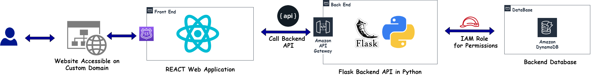
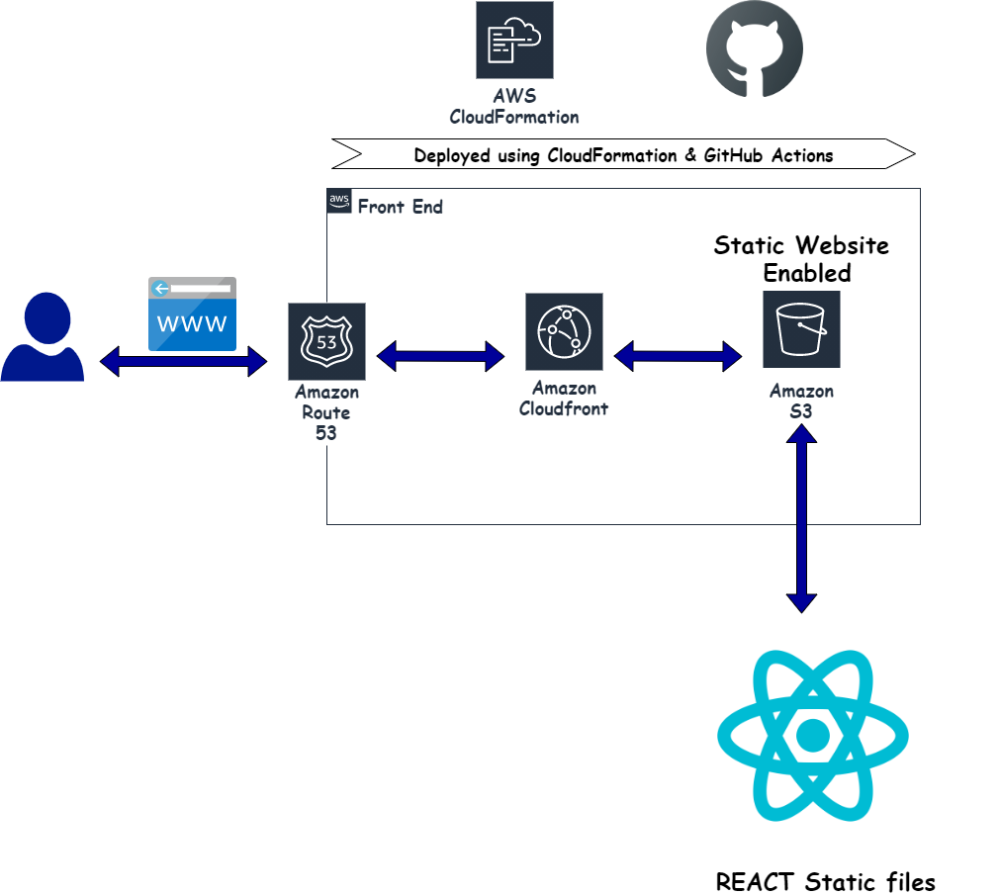
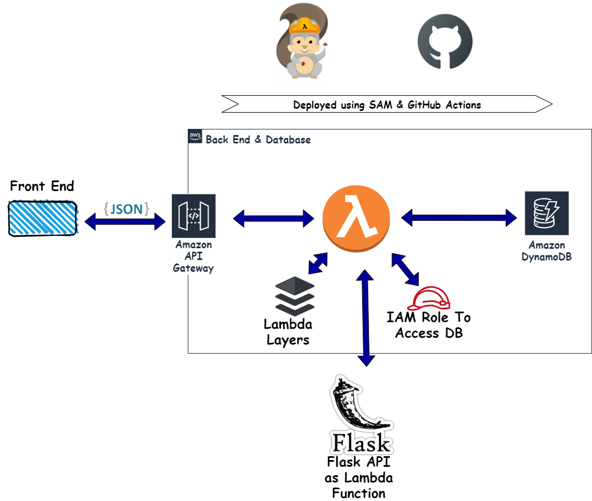
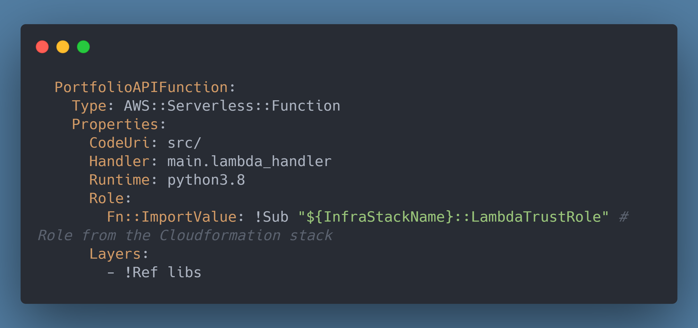
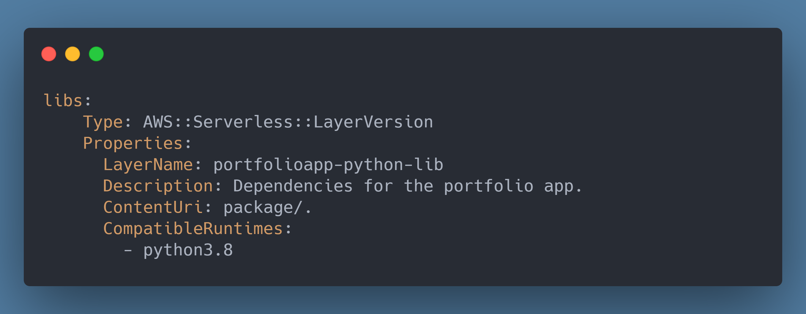
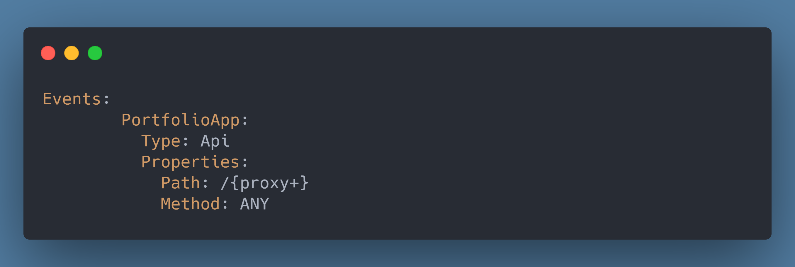
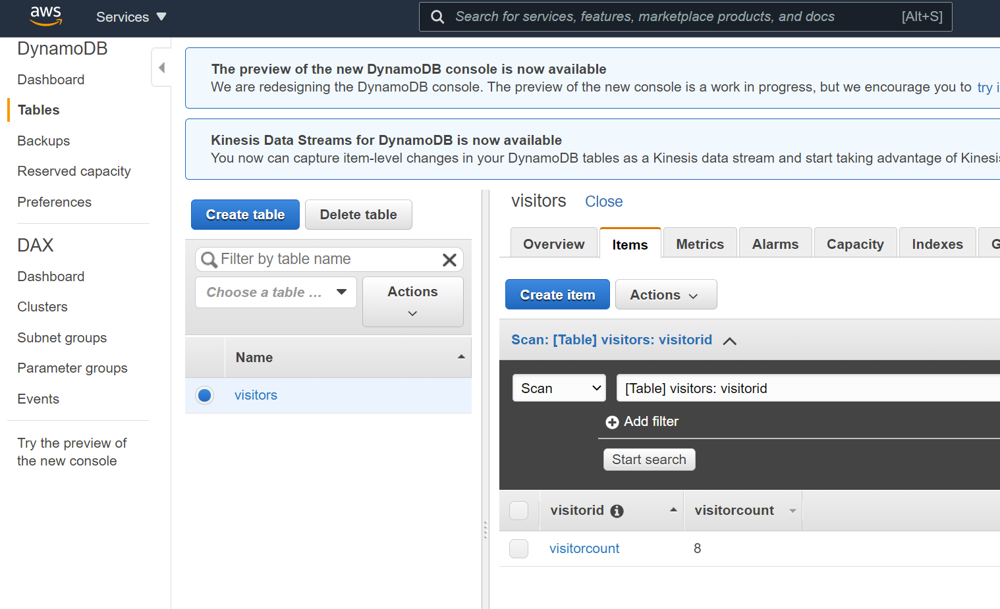
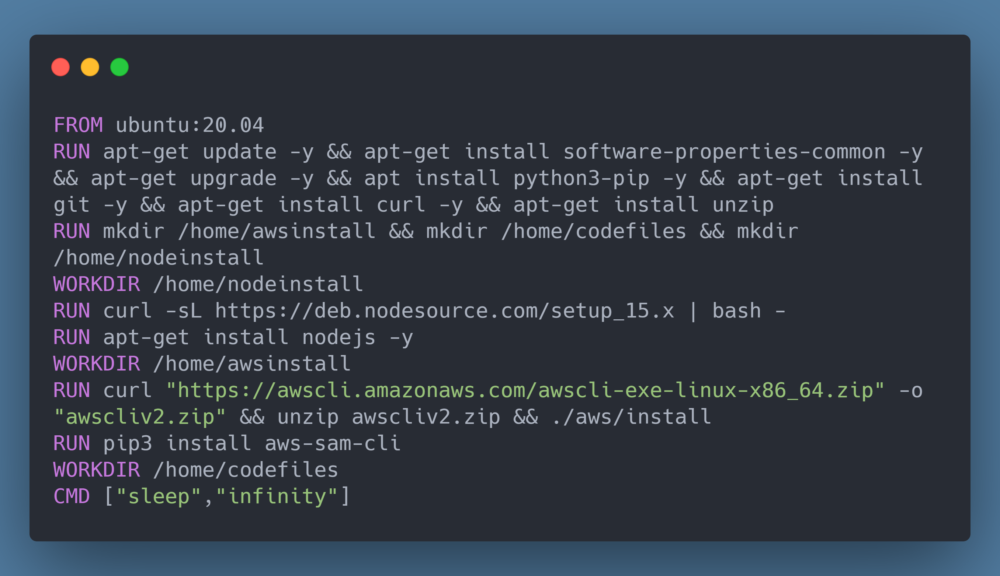
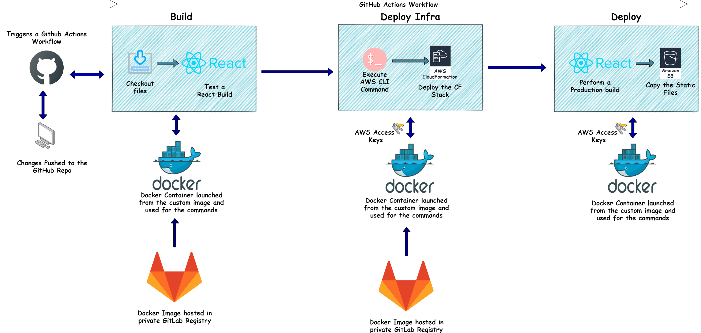
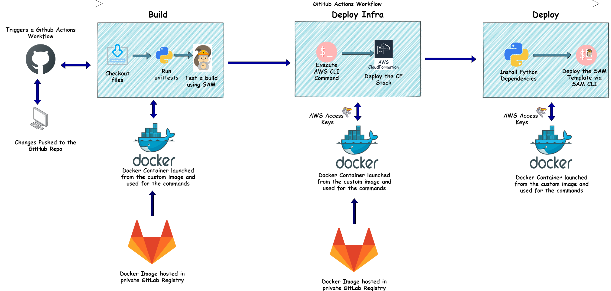

# A Cloud Resume built with React and Deployed to AWS using S3 and Lambda  

In this post I will be describing how I completed the Acloud Guru challenge to develop and deploy a Cloud Resume website on AWS. The details of the challenge can be found <a href="https://cloudresumechallenge.dev/instructions/" target="_blank">Here</a>.  
It was a really interesting challenge and helped me learn a few new things. Having an own resume website is very useful nowadays since everything is moving to cloud now. So its natural to have your experience and profile on cloud too.  
Here I describe how I developed and deploy my portfolio website. Hopefully this will help someone to build a website of their own. Now there are many ways to achieve the same result. This post is my method of the Dev and Deploy process.  

The codebase for this post can be found <a href="https://github.com/amlana21/resume-challenge-publish" target="_blank">Here</a> . 

## About the Challenge and the Website  
Let me first give an overview about what the requirements for the challenge were. At high level these are the main objectives which were to be achieved:  
  - Develop the resume as a website using HTML and CSS  
  - Host the HTML files on AWS S3 and host the same as a static website via S3  
  - A custom domain to point to the website. Hitting the custom domain should open up the resume website and it should be serving over https  
  - Include a visitor counter on the Website. The counter should read the count related details from a backend DynamoDB via an API  
  - The API should be developed using Python  
  - The whole Infrastructure have to be define using SAM templates (IAAC) and version controlled  
  - Finally to deploy the whole website, there should be two separate CI/CD Pipelines: One for Front end and one for Back end  

For my Website, here are the high level details about how I built and deployed.  
  - For the Front end I built a React web app and built it as an SPA (Single page application)  
  - For the Backend, its a Python Flask API which gets the data from the DynamoDB. The Flask API is deployed as a Lambda function  
  - Whole architecture is built using a SAM Template  
  - The deployment is automated using a Github actions workflow which gets triggered when changes are pushed to the main branch on the Github repo.  

The website also shows the Visitor count on the homepage. The Visitor count gets stored in a DynamoDB which gets accessed via the Flask API.  

Let me go through some more detail of each of these components.  

## Overall Architecture  

Let me go through a high level explanation of the whole app architecture. The whole system is divided in two parts: FrontEnd and BackEnd. Below image should explain the overall system.  
     

  ### Front End  
  The Front end is a React Single page app. The app communicates with the backend calling the API endpoints. The app has two different UI based on whether it is opened on a desktop or on a mobile device. The React app is built and the static files are deployed to an S3 bucket to host the website. Below are the components which are contained in the whole frontend architecture:  
       

  - <em>S3 Bucket: </em>  
  This is the bucket which stores the static files built from the React app. The bucket is enabled for Static hosting and is made public so the files can be accessed by the Website endpoint. This is deployed using a Cloudformtaion Template. The template is part of my Github repo.  
  - <em>Cloudfront Distribution: </em>  
  This is the CDN which is fronting the website hosted on the S3 bucket. Its a Web distribution with additional domains specified to map my custom domain. This is also deployed using the Cloudformation template where the distribution related parameters are specified.  
  - <em>Route 53 and Hosted Zone: </em>  
  To expose the website, I bought a custom domain from AWS and configured the same via Route 53. Alias records are added to the Route 53 hosted zone for the custom domain. The Alias records point to the Cloudfront distribution. To server the website over https, I also generated a certificate from ACM.  

  ### Back End  
  For the Back end I developed a Flask API. The API exposes endpoints which when accessed performs the actions to update the counter and return back the count from the Dynamo DB database. The Flask API is deployed as a Lambda function and exposed publicly via API Gateway. Whole back end gets deployed using a SAM Template. Below are the components which make up the back end architecture:  
       

  - <em>Lambda Function: </em>  
  The Flask API is deployed as a Lambda function. It exposes different endpoints tp update the count and get the count from the DynamoDB. To connect DynamoDB from the Python code, I am not storing any credentials in the code. An IAM role is being assigned to the Lambda function which provides it the necessary permissions to access the DynamoDB. The DB stores the Visitor count on a column which is read by the Lambda function and returned back as response. This function is deployed with the SAM template. The SAM template is part of my repo.  
     
  - <em>Lambda Layers: </em>  
  The dependencies for the Python Lambda function are collated in a Lambda Layer. The Lambda layer is also created via the SAM template and gets associated to the Lambda function. The dependencies get uploaded to the Layer from a local package folder where the dependencies are pre-installed from the requirements file. In the actual deployment scenario, this is handled by the CI/CD pipeline.  
     
  - <em>API Gateway: </em>  
  The Lambda function and the API endpoints are exposed publicly via an API gateway. Its a simple API gateway deployed as part of the SAM template. All of the Lambda function routes are routed via the API gateway. This gets inherently created with the SAM deployment and I have not customized the one which gets created.  
       
  - <em>DynamoDB: </em>  
  This is the backend data table which also gets deployed by the SAM template. The Visitors data table is created with a primary key of Visitorid. This will only contain a count of the visitors and no other records. This is how the data will look:  
       
  I have deployed a very basic settings DynamoDB table to stay within the free tier for now.  

  - <em>Monitoring: </em>  
  Both Front end and back end is being monitored by Cloudwatch where I have setup a few alerts to alert me of any error. These are the alerts which I have setup to monitor each stack:  
    - Front End: For front end I have set Cloud watch alerts based on the Cloudfront error metrics and sends out email to a SNS topic where I am subscribed  
    - Back end: For the backend, the Cloudwatch alert is set on the Cloudwatch Log group for the backend Lambda function. The alert sends out email based on error strings on the Cloud watch log.  

## Deployment and CI/CD Pipeline  

To deploy the various components of the app architecture, I am using Github actions workflow and automating the whole deployment process. There are two separate workflows built to deploy the Front end and the backend separately. There are two different Github repos for Front end and Backend which triggers the respective Github actions flows. Both of the Github flow files are in my Github repo and can be referenced. Let me go through each of the flows.  

  ### Custom Docker Image and Registry  
  Since all of the deployment commands will be involving SAM CLI and AWS CLI, I created a custom Docker image which contains both of these installed. The CLI gets configured via Environment variables which gets passed while initializing the container using the Docker image.  
       
  The Docker image is stored in a private registry which I created on Gitlab. The Gitlab login token is passed as Secret to the Gihub repo and is used in the Actions workflow to login and pull the Docker image to run the container. All the deployment commands are run on this container.  

  ### Front End Flow  
  Below image shows the steps which is built as part of the Github actions flow.  
       

  Below are the steps happening in the workflow:  
  - <em>Build: </em>  
  In this step I am performing a test build of the React app to check if it is successfully getting built after any change to the code. If the build fails, the whole workflow fails and sends out a notification to me. In this step these are the actions which are happening:  
    - Run the Docker container from the custom Docker image  
    - Checkout the code and run npm install to install all dependencies  
    - Run the build command to build the static files from the React app. If build fails, the workflow fails  

  - <em>Deploy Infra: </em>  
  In this step I am deploying the necessary infrastructure needed to support deploying the Front end files and expose the website. The infra components are deployed using a Cloudformation template which launches a new Stack on AWS. Below are the components which get deployed by the Cloudformation Template:  
    - S3 Bucket and setup the Static website property for the bucket  
    - Cloudfront distribution with the above S3 bucket as Origin  
  The Cloudformation deploy command is executed in the Docker container launched from the custom Docker image where the AWS keys are passed as env variables.  

  - <em>Deploy: <em>  
  This is the final step where the React app is built and the static files generated are copied to the S3 bucket enabled for static hosting. Once the files get deployed to the S3 bucket, the website can be accessed via the Cloudfront endpoint.  

  This whole flow runs every time a change is pushed to the repo. If there is no change to a specific file involved in a specific stage, no changes are applied and the flow moves on to next step.   

  ### Back End Flow  
  Below image shows how the flow works to deploy the Back end components.  
       

  - <em>Build: </em>  
  In this step I am running some Python unit tests on the code to test that the new changes are not causing any errors. If the test fails, the workflow fails and sends out a notification to me. I am also executing a SAM build in this step to test out that the build is also happening successfully. Overall these are the tasks happening in this step:  
    - Launch the Docker container from the custom image  
    - Install all the Python dependencies from the requirements file  
    - Run the unit tests. If failing, the workflow fails  
    - Run a sample build to ensure build is successful  

  - <em>Deploy Infra: </em>  
  In this step I am deploying the necessary supporting infrastructure needed for the Serverless components deployed by the SAM template. The infra components are defined in a Cloudformation template which I am using to create a stack on AWS. I m running the AWS command inside the Docker container launched from the custom image. Below are the components which get deployed by this template:  
    - S3 bucket for the SAM package artifacts  
    - IAM role which will be assumed by the Lambda function  

  - <em>Deploy: </em>  
  In this step I am finally deploying the Serverless components to AWS via the SAM CLI. The SAM command is executed inside the Docker container launched from the custom Docker image. Below are the tasks happening in this step:  
    - Install the Python dependencies in a package folder. This is needed for the Lambda layer  
    - Execute the SAM deploy command to start deploying the Serverless components  
  Once the deployment is done, the API endpoint will be shown on the Github actions workflow execution console.  

  ### Route 53 Changes  
  Once the both of the deployments are done, I still have to expose the website over my custom domain. To expose the Cloudfront endpoint via the custom domain, I added two Alias records in the Route 53 hosted zone for my custom domain. The two records are to cover the two domain records:  
    - Apex domain  
    - www sub domain    
  I also had to provision a certificate in ACM so the website endpoint can be served over https.  

Once all these changes are done, hitting my website domain opens up the resume website and shows the Visitor count at the top. If there is any issue with the API, the Visitor icon shows an error but the rest of the web page still loads normally.  

## Conclusion  
I really enjoyed working on this challenge as I learnt some new tips and tricks while developing for the project. In this post I tried to document at a very high level about my approach and hopeful this will help someone with their approach to the challenge. For full details of the project please visit the code repo on Github. I also write my own blog about cloud technologies and if any questions I can be reached out <a href="https://amlanscloud.com" target="_blank">Here</a>  

  

